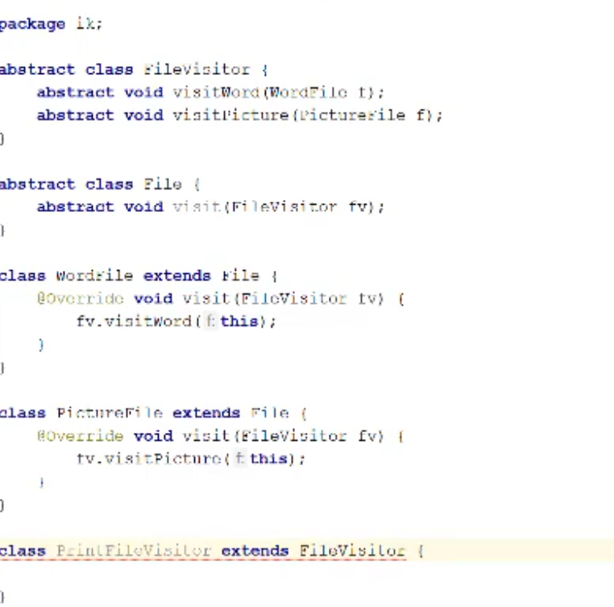
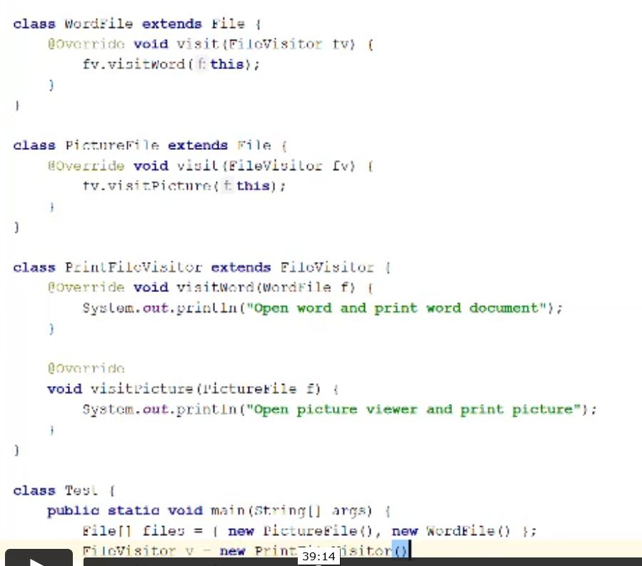

**Visitor pattern** can be used where you have a lot of objects (i.e. file types) and where you need to frequently add 
methods to the files. Because there are a lot of file types, methods will need to be added to many files which is messy.

Here a visitor pattern can be used where we can add an abstract visitor class which has a method to visit each of the file types. 
When we add a new method we can add it into the visitor, rather than having to add it to each of the files. 

We have a concrete visitor class for each of the methods (i.e. print). The concrete class has methods to handle the 
appropriate operation for each of the file types. The right instance of the method will be called because the method 
gets passed the appropriate file type as param. 

