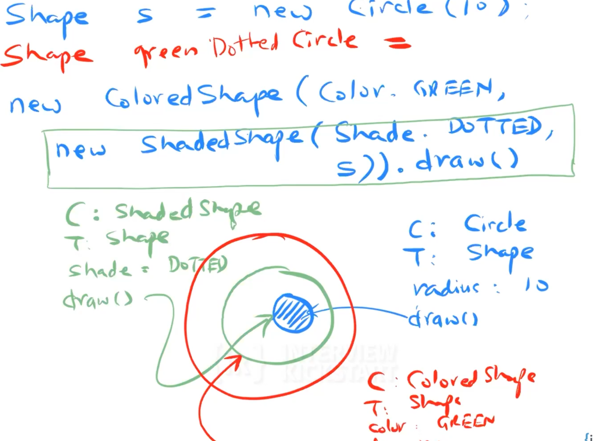

Is useful when you have a list of classes which have some additional properties.
The cartesian product of classes and their properties will lead to a very large list of classes.
So instead of using inheritance, we can use a collection of objects 
that are composed together to provide the desired behavior. 

For example : A cheese thin crust pizza can be constructed via :

1. Creating a think crust pizza
2. Creating a cheese pizza from the think crust pizza (already created in 1)
3. Create an olive pizza by using the cheese pizza (already created in 2)

Decorator pattern

See the colored taking params and another shape class as parameters, 
this layering allows you to decorate multiple behaviors together. 
